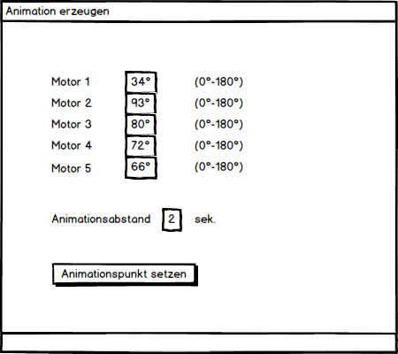

# TransportationScript
**How to install MayaCharm**
--------
Maya integration with run and debug configurations for Maya. MayaCharm lets you execute the current document or
arbitrary code as if it was in Maya from PyCharm. For users of the professional version of PyCharm it will also setup
and connect the pydev debugger to Maya as well.

For those simply just wanting the compiled version, you are best to just search for it, in the plugin repository of PyCharm.
https://plugins.jetbrains.com/plugin/8218?pr=pycharm

**Verbindung zwischen Maya und PyCharm herstellen**
--------
Unter Laufwerk\Users\username\Documents\maya\2018\scripts ein Script namens userSetup.py reinhauen:
```
    import maya.cmds as cmds
    if not cmds.commandPort(':4434', q=True):
      cmds.commandPort(n=':4434') 
``` 

**Script vorbereiten für Maya**
--------
Beim File das Script angeben und dann sollte das offene Maya File Änderungen des Scripts ändern.


**Umsetzung**
--------
- Zuerst wird der Benutzer nach der Reihe(x) und der Spalte(y) an der das Paket im Regal plaziert werden soll. Dabei wird ebenfalls die Position der einselnen Motoren des Roboterarms angepasst.
- Dannach wird der Roboterarm richtig plaziert und ein neues GUI-Fenster öffnet sich in dem alle Motoren angezeigt werden (mit den eingestellten Graden). Weiters wird darunter die Zeit zwischen diesen Animationspunkten(Keyframes) wählbar gemacht. Es wäre dabei auch noch ganz gut zu schnelle Aniamtionen (wenn man einen zu kurzen Abstand zwischen den Animationen setzt) ein Fehler beim setzen ausgegeben werden. GUI Bsp.:

- Aus dieser Animation werden nun 4 Zeitpunkte heruasgenommen und nebeneinander zeitlich proportional dargestellt. Diese werden dann 3d gedruckt
